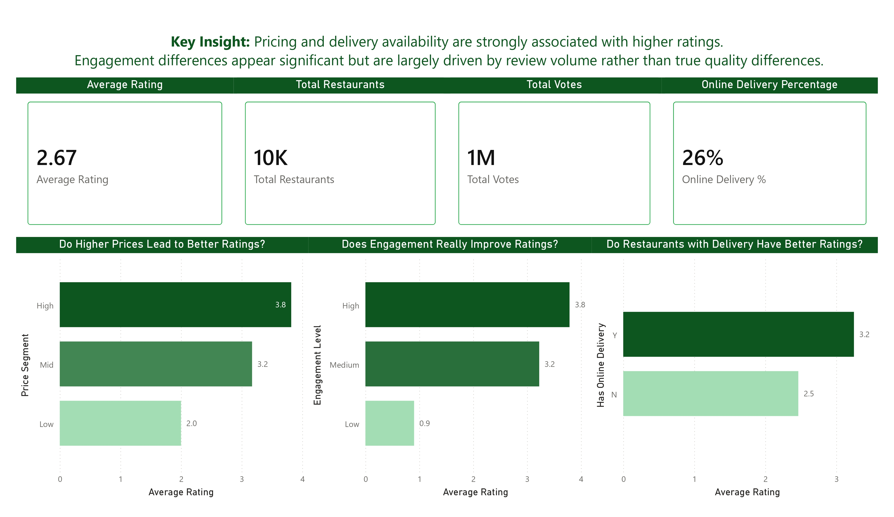
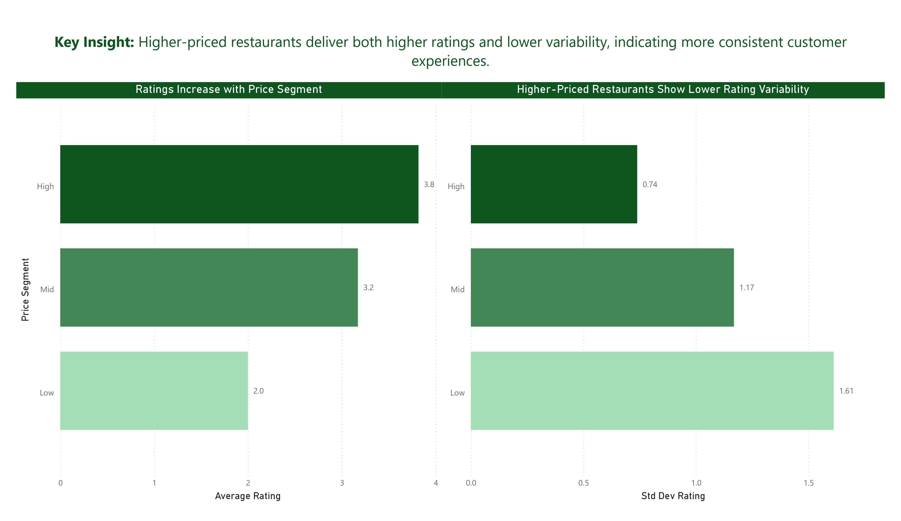
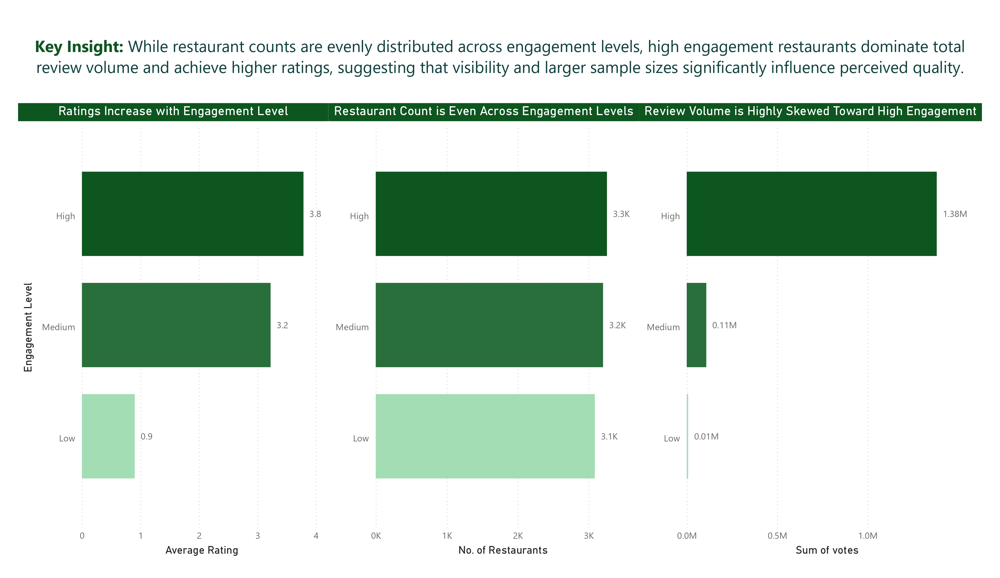
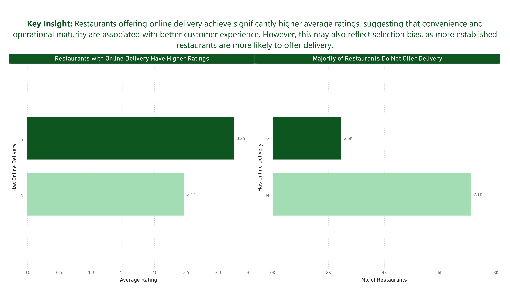

# 🍽️ Zomato Marketplace Analytics

## Project Overview

This project analyzes restaurant performance across the Zomato marketplace using SQL and Power BI.

The objective is to understand how pricing, customer engagement, and platform features such as online delivery relate to restaurant ratings and customer perception.

The analysis focuses on identifying marketplace patterns that can support product, operational, and growth decisions.
---

# Dashboard Preview

## Executive Summary



## Price Analysis



## Engagement Analysis



## Online Delivery Analysis



---

## Business Objective

Food delivery platforms operate complex multi-city marketplaces where customer satisfaction is influenced by multiple factors.

This project investigates:

* Whether online delivery is associated with higher ratings
* How pricing relates to customer perception
* Whether restaurant popularity reflects quality
* Which cities provide the strongest value for customers
* How rating behavior varies across different market segments

---

## Dataset Overview

**Source:** Kaggle — Zomato Global Restaurant Dataset

**Records:** ~50,000 restaurants

**Scope:** Multiple countries and cities

**Grain:** One row per restaurant

### Key Fields

* Restaurant ID
* City
* Country Code
* Cuisines
* Average Cost for Two
* Currency
* Price Range
* Aggregate Rating
* Votes
* Has Online Delivery
* Has Table Booking

---

## Data Modeling Approach

To maintain reproducibility and traceability, the project uses a two-layer SQL model.

### 1. `zomato_raw`

Stores the original dataset without modification.

### 2. `zomato_analytics`

Cleaned analytical layer used for all reporting and dashboarding.

### Feature Engineering

Additional analytical fields were created:

* **Price Segment**

  * Low
  * Mid
  * High

* **Engagement Level**

  * Low
  * Medium
  * High

All transformations were performed using SQL.

---

## Tools Used

* SQL (PostgreSQL)
* Power BI
* GitHub
* Notion

---

## Business Questions

### 1. Do restaurants with online delivery receive higher ratings?

### 2. Does higher price imply better ratings?

### 3. Are high-vote restaurants genuinely better rated?

### 4. Is the price-rating relationship consistent across cities?

### 5. Do premium restaurants provide more consistent customer experiences?

### 6. Which cities offer the strongest rating-to-price balance?


# Key Findings

## 1️⃣ Online Delivery is Associated with Higher Ratings

| Delivery Availability | Average Rating |
| --------------------- | -------------- |
| Yes                   | 3.25           |
| No                    | 2.47           |

Restaurants offering online delivery achieve substantially higher ratings than those without delivery capability.

### Interpretation

This suggests convenience and operational maturity are positively associated with customer satisfaction.

### Limitation

The relationship may reflect selection bias, as more established restaurants are more likely to offer delivery services.

---

## 2️⃣ Higher-Priced Restaurants Receive Better Ratings

| Price Segment | Average Rating |
| ------------- | -------------- |
| High          | 3.82           |
| Mid           | 3.17           |
| Low           | 2.00           |

Ratings increase consistently across price segments.

### Interpretation

Higher-priced restaurants tend to receive stronger customer ratings, suggesting a positive association between pricing and perceived quality.

### Limitation

Price may act as a proxy for service quality, ambiance, brand reputation, or location advantages.

---

## 3️⃣ Premium Restaurants Deliver More Consistent Experiences

| Price Segment | Avg Rating | Rating Std Dev |
| ------------- | ---------- | -------------- |
| High          | 3.82       | 0.74           |
| Mid           | 3.17       | 1.17           |
| Low           | 2.00       | 1.61           |

Rating variability decreases as price increases.

### Interpretation

Premium restaurants are not only rated higher but also provide more predictable customer experiences.

### Key Takeaway

Price appears to function as both a quality signal and a consistency signal within the marketplace.

---

## 4️⃣ Engagement Differences Are Largely Driven by Review Volume

| Engagement Level | Avg Rating | Restaurants | Reviews |
| ---------------- | ---------- | ----------- | ------- |
| High             | 3.79       | 3,259       | 1.38M   |
| Medium           | 3.23       | 3,204       | 108K    |
| Low              | 0.90       | 3,088       | 7.7K    |

Restaurant counts remain relatively stable across engagement groups.

However, review volume is heavily concentrated among highly engaged restaurants.

### Interpretation

The observed rating gap is largely influenced by review volume and visibility rather than quality alone.

### Analyst Validation

Initially, low-engagement restaurants appeared significantly worse.

Further analysis revealed that these restaurants receive very few reviews, making their ratings less reliable and more volatile.

---

## 5️⃣ Price-Rating Relationship is Consistent Across Cities

Analysis across:

* New Delhi
* Gurgaon
* Noida
* Faridabad

shows ratings consistently increase as price segments rise.

### Interpretation

The relationship is not isolated to a single market and appears to reflect broader marketplace behavior.

### Correlation Analysis

```sql
SELECT
    CORR(price_range, aggregate_rating)
FROM zomato_analytics;
```

**Result:** 0.44

A moderate positive correlation exists between pricing and customer ratings.

### Key Takeaway

Price positioning is associated with perceived quality, but it explains only part of rating behavior across the platform.

---

# Business Recommendations

## Marketplace Strategy

### Encourage Online Delivery Adoption

Restaurants offering delivery consistently receive higher ratings.

Improving delivery availability may enhance customer satisfaction and platform engagement.

### Improve Visibility for Low-Engagement Restaurants

Low-engagement restaurants suffer from sparse-review bias.

Increasing exposure may produce more stable and representative ratings.

### Focus on High-Quality Restaurant Acquisition

Premium restaurants demonstrate both stronger ratings and lower variability, making them attractive marketplace partners.

---

## Product Strategy

### Incorporate Review Volume Into Ranking Models

Ratings alone can be misleading when review counts are low.

### Surface Rating Confidence Indicators

Displaying review volume alongside ratings can improve decision-making for users.

### Avoid Overweighting Sparse Ratings

Restaurants with limited review counts should be treated cautiously in recommendation systems.

---

# Repository Structure

```text
zomato-analytics/
│
├── README.md
│
├── sql/
│   ├── 01_setup/
│   ├── 02_data_modeling/
│   ├── 03_feature_engineering/
│   └── 04_analysis/
│
├── powerbi/
│   └── zomato_analytics.pbix
│
└── screenshots/
    ├── executive_summary.jpg
    ├── pricing_analysis.jpg
    ├── engagement_analysis.jpg
    └── delivery_analysis.jpg
```

---

# Key Takeaway

This project demonstrates SQL-based analytical thinking on a real-world marketplace dataset.

The analysis shows that pricing and operational features such as online delivery are more strongly associated with restaurant ratings than raw popularity alone.

A deeper investigation into engagement metrics revealed that review volume plays a significant role in shaping perceived quality, highlighting the importance of validating assumptions before drawing business conclusions.

---

# Limitations

* Correlation does not imply causation.
* Ratings may be influenced by factors not captured in the dataset.
* Low-engagement restaurants suffer from sparse-review bias.
* Customer behavior may differ across countries and cities.
* Cross-country pricing comparisons require careful interpretation due to currency differences.

---

# Author

**Anuj Verma**

Data Analytics Portfolio Project

**Skills Demonstrated**

* SQL Analytics
* Data Modeling
* Feature Engineering
* Business Intelligence
* Power BI Dashboarding
* Data Storytelling
* Marketplace Analytics
